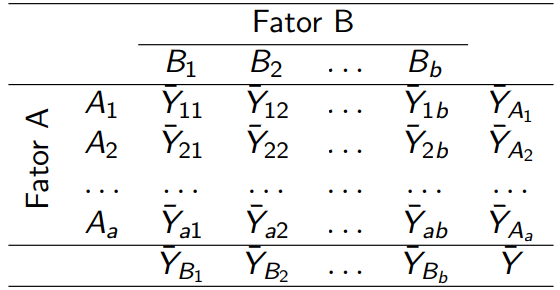

```{r setup, include=FALSE}
knitr::opts_chunk$set(echo = TRUE)
```

# Introdução

## Esquema Fatorial

\quad O esquema fatorial consiste na analise de um ou mais fatores de tratamentos, ou seja, todas as possiveis combinações dos níveis dos fatores são testadas. Por exemplo, se temos um fator A com dois níveis e um fator B com 4 níveis, teremos 2 x 4 = 8 combinações a serem testadas, assim as combinações passam a ser os tratamentos.

\quad Para exemplificar melhor, considere um processo de usinagem, onde desaja-se verificar o efeito do avanço, profundidade de corte e geometria da ferramenta na rugorisade superficial. Para realização do exeprimento, foi considerado três níveis para o avanço ($A_1$,$A_2$,$A_3$), 2 níveis para a profundidade do corte ($B_1$,$B_2$) e dois níveis para a geometria da ferramenta ($C_1$, $C_2$), Carpinet (2009, pag. 108).

\quad Em um exeperimento fatorial completo são realizadas todas as possiveis combinações dos nívies dos fatores. No exemplo, temos 3 x 2 x 2 = 12 combinações de teste, conforme segue na tabela.

|               |               |
|---------------|---------------|
| $A_1 B_1 C_1$ | $A_1 B_1 C_2$ |
| $A_1 B_2 C_1$ | $A_1 B_2 C_2$ |
| $A_2 B_1 C_1$ | $A_2 B_1 C_2$ |
| $A_2 B_2 C_1$ | $A_2 B_2 C_2$ |
| $A_3 B_1 C_1$ | $A_3 B_1 C_2$ |
| $A_3 B_2 C_1$ | $A_3 B_2 C_2$ |

: Combinações de teste de um experimento fatorial 3x2

```{=tex}
\begin{table}
  \begin{center}
  \caption{Combinações de teste de um experimento fatoria 3x2}
    \begin{tabular}{ l  r  }
      A_1 B_1 C_1 & A_1 B_1 C_2\\
      A_1 B_2 C_1 & A_1 B_2 C_2\\
      A_2 B_1 C_1 & A_2 B_1 C_2\\
      A_2 B_2 C_1 & A_2 B_2 C_2\\
      A_3 B_1 C_1 & A_3 B_1 C_2\\
      A_3 B_2 C_1 & A_3 B_2 C_2\\
    \end{tabular}
  \end{center}
\end{table}
```

\quad No geral, quando deseja-se estudar os efeitos dos fatores, planejamentos fatoriais são mais eficientes. Generalizando o exemplo anterior, considere agora que temos um fator A com $a$ níveis, um fator B com $b$ níveis e um fator C com $c$ níveis, teremos abc combinações, sendo assim cada réplica ira conter todas as abc combinações de tratamentos. Em um esquema fatorial os fatores são ditos cruzados, quando são dispostos.

\quad O efeito de um fator é definido como a mudança no valor observado da variável resposta quando o muda-se o nível do fator. Geralmente chamado de efeito principal, refere-se aos fatores primários de interesse no experimento.

## Esquema Fatorial 2x2 Completo

\quad Considerado como o esquema fatorial mais simples, envolvendo somente dois fatores A e B, tendo cada um desses dois fatores um número de níveis a ser testado, consideramos $a$ níveis para o fator A e $b$ níveis para o fator B. Assim, termos ab comibinações no experimento. Nesse tipo de experimento, podemos testar:

  - a resposta é alterada significativamente quando o nível do fator A é alterado;
  - a resposta é alterada significativamente quando o nível do fator B é alterado;
  - a alteração na resposta quando da alteração do nível do fator A (ou B) é dependente do nível do fator B (ou A), ou seja, se existe efeito de interação entre os dois fatores.

\quad Assim, considerando um delineamento inteiramente casualizado com $n$ repetições, os dois fatores A com $a$ níveis e B com $b$, o modelo estatístico é dado por:

$$ y_{ikj} = \mu + \alpha_i + \gamma_j + (\alpha\gamma)_{ik} + \epsilon_{ikj} $$

onde:

-   $\mu$ é a média geral
-   $\alpha_i$ é o efeito o i-ésimo nível do fator A, i = 1,...,$a$
-   $\gamma_j$ é o efeito do j-ésimo nível do fator B, j = 1,...,$b$
-   $(\alpha\gamma)_{ij}$ é o efeito da interação entres os fatores A e B
-   $\epsilon_{ijk}$ é o erro experimental
```{r}

```

# Fatorial fracionado

Em situações nas quais o pesquisador pode aceitar como desprezíveis os efeitos das interações de segunda ordem e superiores, então as informações interessantes sobre os efeitos princiais e sobre as interações de primeira ordem, podem ser obtidas através de uma fração de um fatorial completo.

Delineamentos desse tipo são ditos delineamentos fatoriais fracionados e têm grande utilidade nos experimentos que antecedem ao experimento final, como no caso da seleção de fatores e de seus níveis (screening desing) e são exaustivamente utilizados no desenvolvimento e na otimização de processos e produtos. 

Um dos principais usos deste delineamento são em experimentos de triagem, experimentos no quais muitos fatores são considerados e o objetivo é identifica aqueles fatores (se houver) que têm grandes efeitos. Os experimentos de triagem geralmente são realizados nos estágios iniciais de um projeto, quando muitos dos fatores inicialmente considerados prováveis têm pouco ou nenhum efeito sobre a resposta. Os fatoes identiicados como importantes são então investigados mais detalhadamente em experimetnos subsequentes.

O uso bem-sucedido de experimentos fatoriais fracionários é baseado em três ideias-chave: 

  1. **O princípio da esparsidade dos efeitos**:  Quando há várias variáveis, o sistema ou processo provavelmente será conduzido principalmente por alguns dos principais efeitos e interações de baixa ordem.  
  1. **A propriedade de projeção**.  Os experimentos fatoriais fracionários podem ser projetados em experimentos mais fortes (maiores) no subconjunto de fatores significativos.  
  1. **Experimentação sequencial**.  É possível combinar as execuções de dois (ou mais) fatoriais fracionários para montar sequencialmente um projeto maior para estimar os efeitos dos fatores e as interações de interesse.

## Fatorial 2 1/2 fração

Considere um experimento fatorial $2^4$. Nesse caso, o experimento completo envolve 16 combinações. Suponha que queiramos reduzir o número de combinações de teste para 8. Então, queremos realizar metade de um experimento $2^4$, ou seja, $\frac{1}{2} 2^4 = 2^{-1} 2^4 = 2^{4-1} = 8$ combinações.

Portanto, o experimento básico é um experimento $2^3$, com uma matriz de planejamento ilustrada abaixo.

| Teste | $X_1$ | $X_2$ | $X_3$ |
|-------|----|----|----|
| 1     | -  | -  | -  |
| 2     | +  | -  | -  |
| 3     | -  | +  | -  |
| 4     | +  | +  | -  |
| 5     | -  | -  | +  |
| 6     | +  | -  | +  |
| 7     | -  | +  | +  |
| 8     | +  | +  | +  |

: Matriz de planejamento para experimento $2^3$


Entretanto, uma quarta variável, x4, precisa ser introduzida neste planejamento. Suponha que x4 seja introduzida no experimento de forma que a coluna de sinais correspondente ao efeito 123 seja utilizada para definir os níveis de x4 para as 8 combinações de teste, conforme ilustrado na matriz de planejamento abaixo.

| Teste | 1 | 2 | 3 | 4 = 123 |
|-------|---|---|---|---------|
| 1     | - | - | - | -       |
| 2     | + | - | - | +       |
| 3     | - | + | - | +       |
| 4     | + | + | - | -       |
| 5     | - | - | + | +       |
| 6     | + | - | + | -       |
| 7     | - | + | + | -       |
| 8     | + | + | + | +       |

: Matriz de planejamento para experimento fracionário

E a matriz de cáculo dos efeitos para um planejamento como este é dado por:

| Teste | I | 1  | 2  | 3  | 4  | 12 | 13 | 14 | 23 | 24 | 34 | 123 | 124 | 134 | 234 | 1234 |
| ----- | - | -- | -- | -- | -- | -- | -- | -- | -- | -- | -- | --- | --- | --- | --- | ---- |
| 1     | + | -  | -  | -  | -  | +  | +  | +  | +  | +  | +  | -   | -   | -   | -   | +    |
| 2     | + | +  | -  | -  | +  | -  | -  | +  | +  | -  | -  | +   | -   | -   | +   | +    |
| 3     | + | -  | +  | -  | +  | -  | +  | -  | -  | +  | -  | +   | -   | +   | -   | +    |
| 4     | + | +  | +  | -  | -  | +  | -  | -  | -  | -  | +  | -   | -   | +   | +   | +    |
| 5     | + | -  | -  | +  | +  | +  | -  | -  | -  | -  | +  | +   | +   | -   | -   | +    |
| 6     | + | +  | -  | +  | -  | -  | +  | -  | -  | +  | -  | -   | +   | -   | +   | +    |
| 7     | + | -  | +  | +  | -  | -  | -  | +  | +  | -  | -  | -   | +   | +   | -   | +    |
| 8     | + | +  | +  | +  | +  | +  | +  | +  | +  | +  | +  | +   | +   | +   | +   | +    |

: Matriz de cálculo, experimento fracionário $2^{4-1}$.

Examinando a matriz de cálculo, podemos perceber que muitas das
colunas são idênticas. Das 16 colunas, apenas 8 são únicas, ou seja, a
combinação linear para o cálculo do efeito da variável 1 é o mesmo que para o
cálculo do efeito da interação entre 234. Da mesma forma temos os seguintes
confundimentos:

1 e 234; 12 e 34  
2 e 134; 13 e 24  
3 e 124; 23 e 14  
4 e 123; Média I e 1234  

Assim, as 8 colunas diferentes entre si, quando multiplicada pela coluna de
dados e dividindo por 4 (N/2), são usadas para se obter as combinações lineares
$l_0$, $l_1$, $l_2$, ..., $l_{123}$ de efeitos confundidos.
Assim:

|           |        |                  |
| --------- | ------ | ---------------- |
| $l_0$     | estima | Média + (½) 1234 |
| $l_1$     | estima | 1 + 234          |
| $l_2$     | estima | 2 + 134          |
| $l_3$     | estima | 3 + 124          |
| $l_{12}$  | estima | 12 + 34          |
| $l_{13}$  | estima | 13 + 24          |
| $l_{23}$  | estima | 23 + 14          |
| $l_{123}$ | estima | 4 / 123          |

Se assumimos que as interações de 3 fatores e de 4 fatores podem ser
desprezadas, o experimento produz as seguintes combinações lineares.

|           |        |         |
| --------- | ------ | ------- |
| $l_0$     | estima | Média   |
| $l_1$     | estima | 1       |
| $l_2$     | estima | 2       |
| $l_3$     | estima | 3       |
| $l_{12}$  | estima | 12 + 34 |
| $l_{13}$  | estima | 13 + 24 |
| $l_{23}$  | estima | 23 + 14 |
| $l_{123}$ | estima | 4       |

Associações , como as definidas anteriormente , definem a resolução de um fatorial fracionado De modo geral , a resolução de um fatorial fracionado é igual ao menor número de letras de sua relação definidora . É importante lembrar que quanto maior for a resolução , maior será a utilidade prática do fatorial fracionado.

**Resolução III ** Não há associação entre efeitos principais . Os efeitos principais estlo associados a interações de primeira ordem ( interações de dois fatores ) . As interações de primen ordem estão associadas entre si . Pouco útil na prática.

**Resolução IV** Não há associações entre efeitos principais e interações de primeira orden As interações de primeira ordem estão associadas entre si.

**Resoluçção V**  Não há associação entre efeitos principais. Não há associações entre efeitos principais e interações de preimeira ordem.


## Fatorial 2 1/4 fração

## Fatorial 2 \^(k-p)

## Estrutura do modelo

## Estrutura de resolução 3

# Exemplo prático

<https://www.youtube.com/watch?v=UGqnRCRV1k8&t=566s&ab_channel=CanaldaEngenhariadeManufaturaeQualidade>
