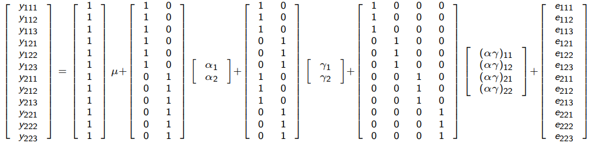

```{r setup, include=FALSE}
knitr::opts_chunk$set(echo = TRUE)
```

# Introdução

Em um esquema fatorial, tem como objetivo avaliar ou testear os níveis presentes de cada em cada fator. No entanto, pode acontecer que tenhamos vários testes a serem realizados e um experimento muito grande. Assim, existe o que chamamos de fatorial fracionário, que consiste reduzir o experimento. Resumidamente, a ideia e reduzir a quantidade de testes a serem feitos, tornando mais ágil a conlusão, entretanto em um esquema fatorial fracionário ocorre-se perda de informações e empobrecimento da análise e sua conclusão.

Este pequeno artigo falará um pouco sobre o esquema fatorial e depois irá aborda o esquema fatorial fracionário.

## Esquema Fatorial

O esquema fatorial consiste na analise de um ou mais fatores de tratamentos, ou seja, todas as possiveis combinações dos níveis dos fatores são testadas. Por exemplo, se temos um fator A com dois níveis e um fator B com 4 níveis, teremos 2 x 4 = 8 combinações a serem testadas, assim as combinações passam a ser os tratamentos.

Para exemplificar melhor, considere um processo de usinagem, onde desaja-se verificar o efeito do avanço, profundidade de corte e geometria da ferramenta na rugorisade superficial. Para realização do exeprimento, foi considerado três níveis para o avanço ($A_1$,$A_2$,$A_3$), 2 níveis para a profundidade do corte ($B_1$,$B_2$) e dois níveis para a geometria da ferramenta ($C_1$, $C_2$), Carpinet (2009, pag. 108).

Em um exeperimento fatorial completo são realizadas todas as possiveis combinações dos nívies dos fatores. No exemplo, temos 3 x 2 x 2 = 12 combinações de teste, conforme segue na tabela.

|               |               |
|---------------|---------------|
| $A_1 B_1 C_1$ | $A_1 B_1 C_2$ |
| $A_1 B_2 C_1$ | $A_1 B_2 C_2$ |
| $A_2 B_1 C_1$ | $A_2 B_1 C_2$ |
| $A_2 B_2 C_1$ | $A_2 B_2 C_2$ |
| $A_3 B_1 C_1$ | $A_3 B_1 C_2$ |
| $A_3 B_2 C_1$ | $A_3 B_2 C_2$ |

: Combinações de teste de um experimento fatorial 3x2

```{=tex}
\begin{table}
  \begin{center}
  \caption{Combinações de teste de um experimento fatoria 3x2}
    \begin{tabular}{ l  r  }
      A_1 B_1 C_1 & A_1 B_1 C_2\\
      A_1 B_2 C_1 & A_1 B_2 C_2\\
      A_2 B_1 C_1 & A_2 B_1 C_2\\
      A_2 B_2 C_1 & A_2 B_2 C_2\\
      A_3 B_1 C_1 & A_3 B_1 C_2\\
      A_3 B_2 C_1 & A_3 B_2 C_2\\
    \end{tabular}
  \end{center}
\end{table}
```

No geral, quando deseja-se estudar os efeitos dos fatores, planejamentos fatoriais são mais eficientes. Generalizando o exemplo anterior, considere agora que temos um fator A com $a$ níveis, um fator B com $b$ níveis e um fator C com $c$ níveis, teremos $abc$ combinações, sendo assim cada réplica ira conter todas as abc combinações de tratamentos. Em um esquema fatorial os fatores são ditos cruzados, quando são dispostos.

O efeito de um fator é definido como a mudança no valor observado da variável resposta quando o muda-se o nível do fator. Geralmente chamado de efeito principal, refere-se aos fatores primários de interesse no experimento.

## Esquema Fatorial 2x2 Completo

Considerado como o esquema fatorial mais simples, envolvendo somente dois fatores A e B, tendo cada um desses dois fatores um número de níveis a ser testado, consideramos $a$ níveis para o fator A e $b$ níveis para o fator B. Assim, termos $ab$ comibinações no experimento. Nesse tipo de experimento, podemos testar:

  - a resposta é alterada significativamente quando o nível do fator A é alterado;
  - a resposta é alterada significativamente quando o nível do fator B é alterado;
  - a alteração na resposta quando da alteração do nível do fator A (ou B) é dependente do nível do fator B (ou A), ou seja, se existe efeito de interação entre os dois fatores.

Assim, considerando um delineamento inteiramente casualizado com $n$ repetições, os dois fatores A com $a$ níveis e B com $b$, o modelo estatístico é dado por:

$$ y_{ikj} = \mu + \alpha_i + \gamma_j + (\alpha\gamma)_{ik} + \epsilon_{ikj} $$

onde:

-   $\mu$ é a média geral
-   $\alpha_i$ é o efeito o i-ésimo nível do fator A, i = 1,...,$a$
-   $\gamma_j$ é o efeito do j-ésimo nível do fator B, j = 1,...,$b$
-   $(\alpha\gamma)_{ij}$ é o efeito da interação entres os fatores A e B
-   $\epsilon_{ijk}$ é o erro experimental

Ou ainda em sua forma matricial:

$$ \boldsymbol{y} = \boldsymbol{X}_G \mu  + \boldsymbol{X}_A \alpha + \boldsymbol{X}_B \gamma + \boldsymbol{X}_{AB} + (\alpha\gamma) + \boldsymbol{\epsilon}$$
Para exemplificar o modelo na forma matricial, considere um experimento fatorial 2x2, feito em um delineamento inteiramente casualizado com 3 repetições para cada tratamento, seja o fator A com e o fator B cada um com 2 níveis, o modelo estatístico na forma matricial será dado por:

```{r}

```

# Fatorial fracionado

Em situações nas quais o pesquisador pode aceitar como desprezíveis os efeitos das interações de segunda ordem e superiores, ou seja, somente as informações de interesse são sobre os efeitos princiais e interações de primeira ordem, o que podem ser obtidas através de uma fração de um fatorial completo.

Esquemas desse tipo são ditos delineamentos fatoriais fracionados e têm grande utilidade nos experimentos que antecedem ao experimento final, como no caso da seleção de fatores e de seus níveis (screening desing) e são exaustivamente utilizados no desenvolvimento e na otimização de processos e produtos. 

Um dos principais uso deste delineamento são em experimentos de triagem, experimentos nos quais muitos fatores são considerados e o objetivo é identifica aqueles fatores (se houver) que tenham grandes efeitos. Os experimentos de triagem geralmente são realizados nos estágios iniciais de um projeto, quando muitos dos fatores inicialmente considerados prováveis têm pouco ou nenhum efeito sobre a resposta. Os fatoes identiicados como importantes são então investigados mais detalhadamente em experimetnos subsequentes.

O uso bem-sucedido de experimentos fatoriais fracionários é baseado em três ideias-chave: 

  1. **O princípio da esparsidade dos efeitos**:  Quando há várias variáveis, o sistema ou processo provavelmente será conduzido principalmente por alguns dos principais efeitos e interações de baixa ordem.  
  1. **A propriedade de projeção**.  Os experimentos fatoriais fracionários podem ser projetados em experimentos mais fortes (maiores) no subconjunto de fatores significativos.  
  1. **Experimentação sequencial**.  É possível combinar as execuções de dois (ou mais) fatoriais fracionários para montar sequencialmente um projeto maior para estimar os efeitos dos fatores e as interações de interesse.

## Fatorial 2 1/2 fração

Considere um experimento fatorial $2^4$. Nesse caso, o experimento completo envolve 16 combinações. Suponha que queiramos reduzir o número de combinações de teste para 8. Então, queremos realizar metade de um experimento $2^4$, ou seja, $\frac{1}{2} 2^4 = 2^{-1} 2^4 = 2^{4-1} = 8$ combinações.

Portanto, o experimento básico é um experimento $2^3$, com uma matriz de planejamento ilustrada abaixo.

| Teste | $X_1$ | $X_2$ | $X_3$ |
|-------|----|----|----|
| 1     | -  | -  | -  |
| 2     | +  | -  | -  |
| 3     | -  | +  | -  |
| 4     | +  | +  | -  |
| 5     | -  | -  | +  |
| 6     | +  | -  | +  |
| 7     | -  | +  | +  |
| 8     | +  | +  | +  |

: Matriz de planejamento para experimento $2^3$


Entretanto, uma quarta variável, $x_4$, precisa ser introduzida neste planejamento. Suponha que $x_4$ seja introduzida no experimento de forma que a coluna de sinais correspondente ao efeito 123 seja utilizada para definir os níveis de $x_4$ para as 8 combinações de teste, conforme ilustrado na matriz de planejamento abaixo.

| Teste | 1 | 2 | 3 | 4 = 123 |
|-------|---|---|---|---------|
| 1     | - | - | - | -       |
| 2     | + | - | - | +       |
| 3     | - | + | - | +       |
| 4     | + | + | - | -       |
| 5     | - | - | + | +       |
| 6     | + | - | + | -       |
| 7     | - | + | + | -       |
| 8     | + | + | + | +       |

: Matriz de planejamento para experimento fracionário

E a matriz de cáculo dos efeitos para um planejamento como este é dado por:

| Teste | I | 1  | 2  | 3  | 4  | 12 | 13 | 14 | 23 | 24 | 34 | 123 | 124 | 134 | 234 | 1234 |
| ----- | - | -- | -- | -- | -- | -- | -- | -- | -- | -- | -- | --- | --- | --- | --- | ---- |
| 1     | + | -  | -  | -  | -  | +  | +  | +  | +  | +  | +  | -   | -   | -   | -   | +    |
| 2     | + | +  | -  | -  | +  | -  | -  | +  | +  | -  | -  | +   | -   | -   | +   | +    |
| 3     | + | -  | +  | -  | +  | -  | +  | -  | -  | +  | -  | +   | -   | +   | -   | +    |
| 4     | + | +  | +  | -  | -  | +  | -  | -  | -  | -  | +  | -   | -   | +   | +   | +    |
| 5     | + | -  | -  | +  | +  | +  | -  | -  | -  | -  | +  | +   | +   | -   | -   | +    |
| 6     | + | +  | -  | +  | -  | -  | +  | -  | -  | +  | -  | -   | +   | -   | +   | +    |
| 7     | + | -  | +  | +  | -  | -  | -  | +  | +  | -  | -  | -   | +   | +   | -   | +    |
| 8     | + | +  | +  | +  | +  | +  | +  | +  | +  | +  | +  | +   | +   | +   | +   | +    |

: Matriz de cálculo, experimento fracionário $2^{4-1}$.

Examinando a matriz de cálculo, podemos perceber que muitas das
colunas são idênticas. Das 16 colunas, apenas 8 são únicas, ou seja, a
combinação linear para o cálculo do efeito da variável 1 é o mesmo que para o
cálculo do efeito da interação entre 234. Da mesma forma temos os seguintes
confundimentos:

1 e 234; 12 e 34  
2 e 134; 13 e 24  
3 e 124; 23 e 14  
4 e 123; Média I e 1234  

Assim, as 8 colunas diferentes entre si, quando multiplicada pela coluna de
dados e dividindo por 4 (N/2), são usadas para se obter as combinações lineares
$l_0$, $l_1$, $l_2$, ..., $l_{123}$ de efeitos confundidos.
Assim:

|           |        |                  |
| --------- | ------ | ---------------- |
| $l_0$     | estima | Média + (½) 1234 |
| $l_1$     | estima | 1 + 234          |
| $l_2$     | estima | 2 + 134          |
| $l_3$     | estima | 3 + 124          |
| $l_{12}$  | estima | 12 + 34          |
| $l_{13}$  | estima | 13 + 24          |
| $l_{23}$  | estima | 23 + 14          |
| $l_{123}$ | estima | 4 / 123          |

Se assumimos que as interações de 3 fatores e de 4 fatores podem ser
desprezadas, o experimento produz as seguintes combinações lineares.

|           |        |         |
| --------- | ------ | ------- |
| $l_0$     | estima | Média   |
| $l_1$     | estima | 1       |
| $l_2$     | estima | 2       |
| $l_3$     | estima | 3       |
| $l_{12}$  | estima | 12 + 34 |
| $l_{13}$  | estima | 13 + 24 |
| $l_{23}$  | estima | 23 + 14 |
| $l_{123}$ | estima | 4       |

Associações , como as definidas anteriormente , definem a resolução de um fatorial fracionado De modo geral , a resolução de um fatorial fracionado é igual ao menor número de letras de sua relação definidora . É importante lembrar que quanto maior for a resolução , maior será a utilidade prática do fatorial fracionado.

**Resolução III ** Não há associação entre efeitos principais . Os efeitos principais estão associados as interações de primeira ordem (interações de dois fatores) . As interações de primeira ordem estão associadas entre si. Pouco útil na prática.

**Resolução IV** Não há associações entre os efeitos principais e interações de primeira orden. As interações de primeira ordem estão associadas entre si.

**Resoluçção V**  Não há associação entre efeitos principais. Não há associações entre efeitos principais e interações de preimeira ordem.


## Estrutura do modelo

Segundo Montgomery (2012), o modelo estatístico que será apresentado pelo uso da relação de definição completa, funciona bem em projetos simples, com as frações regulares, no entanto não funciona tão bem em configurações, onde as frações sejam não regulares. E ainda, existem alguns fatroias fracionários que não possuem relação definidora. 

Como os experimentos fatoriais fracionados podem ter a ocorrencia de confudimento por não trabalhar com todas as possíveis combinações, sendo assim, para apresentar o modelo estatístico será utilizado a estrutura de aliases

Assim, o método usa a representação do modelo polinomial ou de regressão do modelo, ou seja,

$$ \boldsymbol{y} = \boldsymbol{X}_1 \boldsymbol{\beta}_1 + \boldsymbol{\epsilon}$$
onde $\boldsymbol{y}$ é um vetor das respostas, $\boldsymbol{X}_1$ é uma matrix $nxp_1$ contendo a matriz de planejamento que pode ser expandida para a forma do modelo que o pesquisador deseja ajustar, $\boldsymbol{\beta}_1$ é um vetor $p_1 x1$ de parâmetros e $\boldsymbol{\epsilon}$ é um vetor $nx1$ de erros. A estimativa de mínimos quadrados de $\boldsymbol{\beta}_1$ é 

$$ \hat{\boldsymbol{\beta}_1} = (\boldsymbol{X}{'}_1\boldsymbol{X}_1)^{-1}\boldsymbol{X}{'}_1\boldsymbol{y}$$

Agora suponha que o modelo verdadeiro seja,

$$ \boldsymbol{y} = \boldsymbol{X}_1 \boldsymbol{\beta}_1 + \boldsymbol{X}_2 \boldsymbol{\beta}_2 + \boldsymbol{\epsilon} $$
onde $\boldsymbol{X}_2$ é uma matriz $nxp_2$ contendo variáveis adicionais que não estão presentes no modelo ajustado e $\boldsymbol{\beta}_2$ é um vetor $p_2 x1$ dos parâmetros associados a essas variáveis. Assim, podemos mostrar que

$$ E(\hat{\boldsymbol{\beta}_1}) = \boldsymbol{\beta}_1 + (\boldsymbol{X}{'}_1\boldsymbol{X}_1)^{-1}\boldsymbol{X}{'}_1\boldsymbol{X}_2\boldsymbol{\beta}_2 = \boldsymbol{\beta}_1 + \boldsymbol{A}\boldsymbol{\beta}_2$$

$\boldsymbol{A}$ é chamada de matriz de aliase. Os elemtnos desta matriz operão em $\boldsymbol{\beta}_2$ indentificando as relações de aliase para os parâmetos no vetor $\boldsymbol{\beta}_1$.

Para exepmlificar, suponha que em um experimento fatorial fracionado $2^{3-1}$ com a realação definidora $I = ABC$ ou $I = x_1x_2x_3$. O modelo que será ajustado terá somente a presença dos efeitos principais, ou seja

$$y = \mu + \alpha x_1 + \gamma x_2 + \tau x_3 + \epsilon$$
Na notação anterior

$$\boldsymbol{\beta}_1 = \begin{bmatrix}
\mu \\ 
\alpha \\ 
\gamma\\ 
\tau \\
\end{bmatrix} e   \ \ \boldsymbol{X}_1 = \begin{bmatrix}
1 & -1 & -1 & 1 \\ 
 1 & 1  & -1 & -1\\ 
 1 & -1 & 1 & -1\\ 
1 & 1 & 1 & 1
\end{bmatrix}$$

Agora vamos supor que o verdadeiro modelo contenha todas as interaçoes de seunga ordem dos fatores, desse modo,

$$ y = \mu + \alpha x_1 + \gamma x_2 + \tau x_3 + (\alpha\gamma) x_1x_2 + (\alpha\tau) x_1x_3 + (\gamma\tau) x_2x_3+ \epsilon$$
Assim, nosso $\boldsymbol{\beta}_2$ e nossa $\boldsymbol{X}_2$ serão,

$$ \boldsymbol{\beta}_2 = \begin{bmatrix}
(\alpha\gamma) \\ 
(\alpha\tau) \\ 
(\gamma\tau)\\ 
\end{bmatrix}  e \ \ \boldsymbol{X_2} = \begin{bmatrix}
1 & -1 & -1 \\ 
-1 & -1 & 1 \\ 
-1 & 1 & -1 \\ 
 1 & 1 & 1
\end{bmatrix}$$

Logo,

$$ (\boldsymbol{X}{'}_1\boldsymbol{X}_1)^{-1} = (1/4)\boldsymbol{I}_4 \ \ e \ \ \boldsymbol{X}{'}_1\boldsymbol{X}_2 = \begin{bmatrix}
0 & 0 & 0 \\ 
 0 & 0 & 4 \\ 
0 & 4  & 0 \\ 
4 & 0 & 0
\end{bmatrix}$$

Portanto,

$$ E(\boldsymbol{\hat{\boldsymbol{\beta}_1}}) = \boldsymbol{\beta}_1 + \boldsymbol{A}\boldsymbol{\beta}_2 \\  E\begin{bmatrix}
\hat{\mu}\\ 
\hat{\alpha}\\ 
\hat{\gamma}\\ 
\hat{\tau}
\end{bmatrix} = \begin{bmatrix}
\mu\\ 
\alpha\\ 
\gamma\\ 
\tau
\end{bmatrix} + (1/4)\boldsymbol{I}_4\begin{bmatrix}
0 & 0 & 0 \\ 
 0 & 0 & 4 \\ 
0 & 4  & 0 \\ 
4 & 0 & 0
\end{bmatrix}\begin{bmatrix}
(\alpha\gamma) \\ 
(\alpha\tau) \\ 
(\gamma\tau)\\ 
\end{bmatrix} \\ = \begin{bmatrix}
\mu\\ 
\alpha\\ 
\gamma\\ 
\tau
\end{bmatrix} + \begin{bmatrix}
0 & 0 & 0 \\ 
 0 & 0 & 1 \\ 
0 & 1  & 0 \\ 
1 & 0 & 0
\end{bmatrix}\begin{bmatrix}
(\alpha\gamma) \\ 
(\alpha\tau) \\ 
(\gamma\tau)\\ 
\end{bmatrix} \\ = \begin{bmatrix}
\mu\\ 
\alpha\\ 
\gamma\\ 
\tau
\end{bmatrix} + \begin{bmatrix}
0\\ 
(\alpha\gamma)\\ 
(\alpha\tau)\\ 
(\gamma\tau)
\end{bmatrix} \\ = \begin{bmatrix}
\mu \\ 
\alpha + (\gamma\tau)\\ 
\gamma + (\alpha\tau)\\ 
\tau + (\alpha\gamma)
\end{bmatrix}$$

Dessa formar, podemos perceber que cada um dos fatores principais está associado a uma das interaçoes de segunda ordem. Perceba que cada uma das linhas da matriz de aliase representa um dos fatores de $\boldsymbol{\beta}_1$ e cada uma das colunas respresenta um dos fatores de $\boldsymbol{\beta}_2$. Mesmo sendo um exemplo simples, esse método pode ser aplicado a projetos mais complexos.

## Estrutura de resolução 3

# Exemplo prático

<https://www.youtube.com/watch?v=UGqnRCRV1k8&t=566s&ab_channel=CanaldaEngenhariadeManufaturaeQualidade>

<https://support.minitab.com/pt-br/minitab/18/help-and-how-to/modeling-statistics/doe/how-to/factorial/analyze-variability/interpret-the-results/all-statistics-and-graphs/alias-structure/>
estrutura de aliases

pg 253