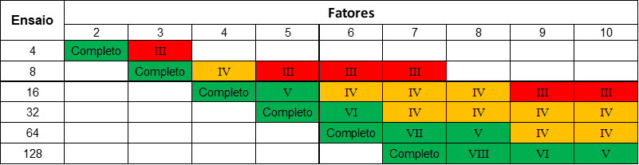

```{r setup, include=FALSE}
knitr::opts_chunk$set(echo = TRUE, message = FALSE, warning = FALSE)
```

# Introdução

Em um delineamento em esquema fatorial tem como objetivo avaliar ou testar os níveis presentes em um experimento com mais de fator. No entanto, com o aumento de níveis e fatores, o experimento pode ficar inviável por conta da quantidade de parcelas a serem instaladas e avaliadas. O delineamento fatorial fracionado é uma alternativa quando se quer reduzir o número de parcelas/ensaios de experimentos com muitos fatores.

Neste documento, abordaremos os principais conceitos por trás do delineamento fatorial fracionado com a resolução de um exemplo prático.

# Esquema fatorial

O esquema fatorial consiste na análise de um ou mais fatores de tratamentos e todas as possíveis combinações dos seus níveis. Por exemplo, se temos um fator A com dois níveis e um fator B com 4 níveis, teremos 2 x 4 = 8 combinações a serem testadas, assim as combinações passam a ser os tratamentos.

Considere, por exemplo, um processo de usinagem, onde deseja-se verificar o efeito do avanço, profundidade de corte e geometria da ferramenta na rugosidade superficial. Para realização do experimento, foi considerado três níveis para o avanço ($A_1$,$A_2$,$A_3$), 2 níveis para a profundidade do corte ($B_1$,$B_2$) e dois níveis para a geometria da ferramenta ($C_1$, $C_2$), Carpinet (2009, pag. 108).

Em um experimento fatorial completo são realizadas todas as possíveis combinações dos níveis dos fatores. No exemplo, temos 3 x 2 x 2 = 12 combinações de teste, conforme segue na tabela.

|               |               |
| :-----------: | :-----------: |
| $A_1 B_1 C_1$ | $A_1 B_1 C_2$ |
| $A_1 B_2 C_1$ | $A_1 B_2 C_2$ |
| $A_2 B_1 C_1$ | $A_2 B_1 C_2$ |
| $A_2 B_2 C_1$ | $A_2 B_2 C_2$ |
| $A_3 B_1 C_1$ | $A_3 B_1 C_2$ |
| $A_3 B_2 C_1$ | $A_3 B_2 C_2$ |

: Combinações de teste de um experimento fatorial 3x2

No geral, quando deseja-se estudar os efeitos dos fatores, planejamentos fatoriais são mais eficientes. Generalizando o exemplo anterior, considere agora que temos um fator A com $a$ níveis, um fator B com $b$ níveis e um fator C com $c$ níveis, teremos $abc$ combinações, sendo assim cada réplica ira conter todas as abc combinações de tratamentos. Em um esquema fatorial os fatores são ditos cruzados, quando são dispostos.

O efeito de um fator é definido como a mudança no valor observado da variável resposta quando o muda-se o nível do fator. Geralmente chamado de efeito principal, refere-se aos fatores primários de interesse no experimento.

Considerado como o esquema fatorial mais simples, envolvendo somente dois fatores A e B, tendo cada um desses dois fatores um número de níveis a ser testado, consideramos $a$ níveis para o fator A e $b$ níveis para o fator B. Assim, termos $ab$ combinações no experimento. Nesse tipo de experimento, podemos testar:

  - a resposta é alterada significativamente quando o nível do fator A é alterado;
  - a resposta é alterada significativamente quando o nível do fator B é alterado;
  - a alteração na resposta quando da alteração do nível do fator A (ou B) é dependente do nível do fator B (ou A), ou seja, se existe efeito de interação entre os dois fatores.

Assim, considerando um delineamento inteiramente casualizado com $n$ repetições, os dois fatores A com $a$ níveis e B com $b$, o modelo estatístico é dado por:

$$ y_{ikj} = \mu + \alpha_i + \gamma_j + (\alpha\gamma)_{ik} + \epsilon_{ikj} $$

onde:

-   $\mu$ é a média geral
-   $\alpha_i$ é o efeito o i-ésimo nível do fator A, i = 1,...,$a$
-   $\gamma_j$ é o efeito do j-ésimo nível do fator B, j = 1,...,$b$
-   $(\alpha\gamma)_{ij}$ é o efeito da interação entres os fatores A e B
-   $\epsilon_{ijk}$ é o erro experimental

Ou ainda em sua forma matricial:

$$ \boldsymbol{y} = \boldsymbol{X}_G \mu  + \boldsymbol{X}_A \alpha + \boldsymbol{X}_B \gamma + \boldsymbol{X}_{AB} + (\alpha\gamma) + \boldsymbol{\epsilon}$$
Para exemplificar o modelo na forma matricial, considere um experimento fatorial 2x2, feito em um delineamento inteiramente casualizado com 3 repetições para cada tratamento, seja o fator A com e o fator B cada um com 2 níveis, o modelo estatístico na forma matricial será dado por:

```{r echo=FALSE, out.width="95%"}
knitr::include_graphics("./dados/modelomatricia2x2.png")
```

# Fatorial fracionado

A partir do esquema fatorial, temos o caso particular de experimentos no esquema fatorial fracionado. Este desenho experimental tem grande utilidade nos experimentos que antecedem ao experimento final, como no caso da seleção de fatores e de seus níveis (screening desing) e são exaustivamente utilizados no desenvolvimento e na otimização de processos e produtos. 

São casos em que o pesquisador considera como desprezíveis os efeitos das interações de segunda ordem e superiores, ou seja, somente as informações de interesse são sobre os efeitos principais e interações de primeira ordem, o que podem ser obtidas através de uma fração de um fatorial completo.

Um dos principais uso deste delineamento são em experimentos de triagem, experimentos nos quais muitos fatores são considerados e o objetivo é identifica aqueles fatores (se houver) que tenham grandes efeitos. Os experimentos de triagem geralmente são realizados nos estágios iniciais de um projeto, quando muitos dos fatores inicialmente considerados prováveis têm pouco ou nenhum efeito sobre a resposta. Os fatores identificados como importantes são então investigados mais detalhadamente em experimentos subsequentes.

O uso bem-sucedido de experimentos fatoriais fracionados é baseado em três ideias-chave: 

  1. **O princípio da esparsidade dos efeitos**:  Quando há várias variáveis, o sistema ou processo provavelmente será conduzido principalmente por alguns dos principais efeitos e interações de baixa ordem.  
  1. **A propriedade de projeção**.  Os experimentos fatoriais fracionados podem ser projetados em experimentos mais fortes (maiores) no subconjunto de fatores significativos.  
  1. **Experimentação sequencial**.  É possível combinar as execuções de dois (ou mais) fatoriais fracionados para montar sequencialmente um projeto maior para estimar os efeitos dos fatores e as interações de interesse.

# Estrutura do modelo

Segundo Montgomery (2012), o modelo estatístico que será apresentado pelo uso da relação de definição completa, funciona bem em projetos simples, com as frações regulares, no entanto não funciona tão bem em configurações, onde as frações sejam não regulares. E ainda, existem alguns fatoriais fracionados que não possuem relação definidora. 

Como os experimentos fatoriais fracionados podem ter a ocorrência de confudimento por não trabalhar com todas as possíveis combinações, sendo assim, para apresentar o modelo estatístico será utilizado a estrutura de aliases

Assim, o método usa a representação do modelo polinomial ou de regressão do modelo, ou seja,

$$ \boldsymbol{y} = \boldsymbol{X}_1 \boldsymbol{\beta}_1 + \boldsymbol{\epsilon}$$
onde $\boldsymbol{y}$ é um vetor das respostas, $\boldsymbol{X}_1$ é uma matriz $nxp_1$ contendo a matriz de planejamento que pode ser expandida para a forma do modelo que o pesquisador deseja ajustar, $\boldsymbol{\beta}_1$ é um vetor $p_1 x1$ de parâmetros e $\boldsymbol{\epsilon}$ é um vetor $nx1$ de erros. A estimativa de mínimos quadrados de $\boldsymbol{\beta}_1$ é 

$$ \hat{\boldsymbol{\beta}_1} = (\boldsymbol{X}{'}_1\boldsymbol{X}_1)^{-1}\boldsymbol{X}{'}_1\boldsymbol{y}$$

Agora suponha que o modelo verdadeiro seja,

$$ \boldsymbol{y} = \boldsymbol{X}_1 \boldsymbol{\beta}_1 + \boldsymbol{X}_2 \boldsymbol{\beta}_2 + \boldsymbol{\epsilon} $$
onde $\boldsymbol{X}_2$ é uma matriz $nxp_2$ contendo variáveis adicionais que não estão presentes no modelo ajustado e $\boldsymbol{\beta}_2$ é um vetor $p_2 x1$ dos parâmetros associados a essas variáveis. Assim, podemos mostrar que

$$ E(\hat{\boldsymbol{\beta}_1}) = \boldsymbol{\beta}_1 + (\boldsymbol{X}{'}_1\boldsymbol{X}_1)^{-1}\boldsymbol{X}{'}_1\boldsymbol{X}_2\boldsymbol{\beta}_2 = \boldsymbol{\beta}_1 + \boldsymbol{A}\boldsymbol{\beta}_2$$

$\boldsymbol{A}$ é chamada de matriz de aliase. Os elementos desta matriz serão operados em $\boldsymbol{\beta}_2$ identificando as relações de aliase para os parâmetros no vetor $\boldsymbol{\beta}_1$.

Para exemplificar, suponha que em um experimento fatorial fracionado $2^{3-1}$ com a relação definidora $I = ABC$ ou $I = x_1x_2x_3$. O modelo que será ajustado terá somente a presença dos efeitos principais, ou seja

$$y = \mu + \alpha x_1 + \gamma x_2 + \tau x_3 + \epsilon$$
Na notação anterior

$$\boldsymbol{\beta}_1 = \begin{bmatrix}
\mu \\ 
\alpha \\ 
\gamma\\ 
\tau \\
\end{bmatrix} e   \ \ \boldsymbol{X}_1 = \begin{bmatrix}
1 & -1 & -1 & 1 \\ 
 1 & 1  & -1 & -1\\ 
 1 & -1 & 1 & -1\\ 
1 & 1 & 1 & 1
\end{bmatrix}$$

Agora vamos supor que o verdadeiro modelo contenha todas as interações de segunda ordem dos fatores, desse modo,

$$ y = \mu + \alpha x_1 + \gamma x_2 + \tau x_3 + (\alpha\gamma) x_1x_2 + (\alpha\tau) x_1x_3 + (\gamma\tau) x_2x_3+ \epsilon$$
Assim, nosso $\boldsymbol{\beta}_2$ e nossa $\boldsymbol{X}_2$ serão,

$$ \boldsymbol{\beta}_2 = \begin{bmatrix}
(\alpha\gamma) \\ 
(\alpha\tau) \\ 
(\gamma\tau)\\ 
\end{bmatrix}  e \ \ \boldsymbol{X_2} = \begin{bmatrix}
1 & -1 & -1 \\ 
-1 & -1 & 1 \\ 
-1 & 1 & -1 \\ 
 1 & 1 & 1
\end{bmatrix}$$

Logo,

$$ (\boldsymbol{X}{'}_1\boldsymbol{X}_1)^{-1} = (1/4)\boldsymbol{I}_4 \ \ e \ \ \boldsymbol{X}{'}_1\boldsymbol{X}_2 = \begin{bmatrix}
0 & 0 & 0 \\ 
 0 & 0 & 4 \\ 
0 & 4  & 0 \\ 
4 & 0 & 0
\end{bmatrix}$$

Portanto,

$$ E(\boldsymbol{\hat{\boldsymbol{\beta}_1}}) = \boldsymbol{\beta}_1 + \boldsymbol{A}\boldsymbol{\beta}_2 \\  E\begin{bmatrix}
\hat{\mu}\\ 
\hat{\alpha}\\ 
\hat{\gamma}\\ 
\hat{\tau}
\end{bmatrix} = \begin{bmatrix}
\mu\\ 
\alpha\\ 
\gamma\\ 
\tau
\end{bmatrix} + (1/4)\boldsymbol{I}_4\begin{bmatrix}
0 & 0 & 0 \\ 
 0 & 0 & 4 \\ 
0 & 4  & 0 \\ 
4 & 0 & 0
\end{bmatrix}\begin{bmatrix}
(\alpha\gamma) \\ 
(\alpha\tau) \\ 
(\gamma\tau)\\ 
\end{bmatrix} \\ = \begin{bmatrix}
\mu\\ 
\alpha\\ 
\gamma\\ 
\tau
\end{bmatrix} + \begin{bmatrix}
0 & 0 & 0 \\ 
 0 & 0 & 1 \\ 
0 & 1  & 0 \\ 
1 & 0 & 0
\end{bmatrix}\begin{bmatrix}
(\alpha\gamma) \\ 
(\alpha\tau) \\ 
(\gamma\tau)\\ 
\end{bmatrix} \\ = \begin{bmatrix}
\mu\\ 
\alpha\\ 
\gamma\\ 
\tau
\end{bmatrix} + \begin{bmatrix}
0\\ 
(\alpha\gamma)\\ 
(\alpha\tau)\\ 
(\gamma\tau)
\end{bmatrix} \\ = \begin{bmatrix}
\mu \\ 
\alpha + (\gamma\tau)\\ 
\gamma + (\alpha\tau)\\ 
\tau + (\alpha\gamma)
\end{bmatrix}$$

Dessa formar, podemos perceber que cada um dos fatores principais está associado a uma das interações de segunda ordem. Perceba que cada uma das linhas da matriz de aliase representa um dos fatores de $\boldsymbol{\beta}_1$ e cada uma das colunas representa um dos fatores de $\boldsymbol{\beta}_2$. Mesmo sendo um exemplo simples, esse método pode ser aplicado a projetos mais complexos.

# Exemplo 1: Fatorial $2^{4-1}$

Considere um experimento fatorial $2^4$. Nesse caso, o experimento completo envolve 16 combinações. Suponha que queiramos reduzir o número de combinações de teste para 8. Então, queremos realizar metade de um experimento $2^4$, ou seja, $\frac{1}{2} 2^4 = 2^{-1} 2^4 = 2^{4-1} = 8$ combinações.

Portanto, o experimento básico é um experimento $2^3$, com uma matriz de planejamento ilustrada abaixo.

| Teste | $X_1$ | $X_2$ | $X_3$ |
| :---: | :---: | :---: | :---: |
| 1     | -     | -     | -     |
| 2     | +     | -     | -     |
| 3     | -     | +     | -     |
| 4     | +     | +     | -     |
| 5     | -     | -     | +     |
| 6     | +     | -     | +     |
| 7     | -     | +     | +     |
| 8     | +     | +     | +     |

: Matriz de planejamento para experimento $2^3$


Entretanto, uma quarta variável, $x_4$, precisa ser introduzida neste planejamento. Suponha que $x_4$ seja introduzida no experimento de forma que a coluna de sinais correspondente ao efeito 123 seja utilizada para definir os níveis de $x_4$ para as 8 combinações de teste, conforme ilustrado na matriz de planejamento abaixo.

| Teste | 1 | 2 | 3 | 4 = 123 |
| :---: |:-:|:-:|:-:|:-------:|
| 1     | - | - | - | -       |
| 2     | + | - | - | +       |
| 3     | - | + | - | +       |
| 4     | + | + | - | -       |
| 5     | - | - | + | +       |
| 6     | + | - | + | -       |
| 7     | - | + | + | -       |
| 8     | + | + | + | +       |

: Matriz de planejamento para experimento fracionado

E a matriz de cálculo dos efeitos para um planejamento como este é dado por:

| Teste |  I  |  1  |  2  |  3  |  4 | 12  | 13  | 14  | 23  | 24  | 34  | 123 | 124 | 134 | 234 | 1234 |
| :---: | :-: | :-: | :-: | :-: | :-:| :-: | :-: | :-: | :-: | :-: | :-: | :-: | :-: | :-: | :-: | :--: |
| 1     | +   | -   | -   | -   | -  | +   | +   | +   | +   | +   | +   | -   | -   | -   | -   | +    |
| 2     | +   | +   | -   | -   | +  | -   | -   | +   | +   | -   | -   | +   | -   | -   | +   | +    |
| 3     | +   | -   | +   | -   | +  | -   | +   | -   | -   | +   | -   | +   | -   | +   | -   | +    |
| 4     | +   | +   | +   | -   | -  | +   | -   | -   | -   | -   | +   | -   | -   | +   | +   | +    |
| 5     | +   | -   | -   | +   | +  | +   | -   | -   | -   | -   | +   | +   | +   | -   | -   | +    |
| 6     | +   | +   | -   | +   | -  | -   | +   | -   | -   | +   | -   | -   | +   | -   | +   | +    |
| 7     | +   | -   | +   | +   | -  | -   | -   | +   | +   | -   | -   | -   | +   | +   | -   | +    |
| 8     | +   | +   | +   | +   | +  | +   | +   | +   | +   | +   | +   | +   | +   | +   | +   | +    |

: Matriz de cálculo, experimento fracionado $2^{4-1}$.

Examinando a matriz de cálculo, podemos perceber que muitas das
colunas são idênticas. Das 16 colunas, apenas 8 são únicas, ou seja, a
combinação linear para o cálculo do efeito da variável 1 é o mesmo que para o
cálculo do efeito da interação entre 234. Da mesma forma temos os seguintes
confundimentos:

|         |                | 
| :-----: | :------------: | 
| 1 e 234 | 12 e 34        | 
| 2 e 134 | 13 e 24        | 
| 3 e 124 | 23 e 14        | 
| 4 e 123 | Média I e 1234 | 

Assim, as 8 colunas diferentes entre si, quando multiplicada pela coluna de
dados e dividindo por 4 (N/2), são usadas para se obter as combinações lineares
$l_0$, $l_1$, $l_2$, ..., $l_{123}$ de efeitos confundidos.
Assim:

|           |        |                  |
| :-------: | :----: | :--------------: |
| $l_0$     | estima | Média + (½) 1234 |
| $l_1$     | estima | 1 + 234          |
| $l_2$     | estima | 2 + 134          |
| $l_3$     | estima | 3 + 124          |
| $l_{12}$  | estima | 12 + 34          |
| $l_{13}$  | estima | 13 + 24          |
| $l_{23}$  | estima | 23 + 14          |
| $l_{123}$ | estima | 4 / 123          |

Se assumimos que as interações de 3 fatores e de 4 fatores podem ser
desprezadas, o experimento produz as seguintes combinações lineares.

|           |        |         |
| :-------: | :----: | :-----: |
| $l_0$     | estima | Média   |
| $l_1$     | estima | 1       |
| $l_2$     | estima | 2       |
| $l_3$     | estima | 3       |
| $l_{12}$  | estima | 12 + 34 |
| $l_{13}$  | estima | 13 + 24 |
| $l_{23}$  | estima | 23 + 14 |
| $l_{123}$ | estima | 4       |

Associações, como as definidas anteriormente, definem a resolução de um fatorial fracionado. De modo geral, a resolução de um fatorial fracionado é igual ao menor número de letras de sua relação definidora. É importante lembrar que quanto maior for a resolução, maior será a utilidade prática do fatorial fracionado. A relação entre as possíveis resoluções e o número de fatores pode ser vista na tabela a seguir:

```{r echo=FALSE, out.width="95%"}

```

**Resolução III ** Não há associação entre efeitos principais . Os efeitos principais estão associados as interações de primeira ordem (interações de dois fatores) . As interações de primeira ordem estão associadas entre si. Pouco útil na prática.

**Resolução IV** Não há associações entre os efeitos principais e interações de primeira ordem. As interações de primeira ordem estão associadas entre si.

**Resolução V**  Não há associação entre efeitos principais. Não há associações entre efeitos principais e interações de primeira ordem.


# Exemplo 2: Fatorial $2^{6-2}$

Montgomery (2017) apresenta em exemplo sobre o encolhimento excessivo em peças de moldagem por injeção. trata-se de 6 fatores em um experimento fatorial fracionado $2^{6-2}$, onde foram realizadas 16 corridas para estes seis fatores. As relações de definição escolhidas foram escolhidas previamente, sendo $I = ABCE$, e $I = BCDF$. A partir destes geradores, podemos escrever os fatores da seguinte forma: $A$, $B$, $C$, e $D$, e então estabelecendo $E = ABC$, e $F = BCD$. O objetivo do planejamento é identificar os fatores que causavam o encolhimento excessivo, ou seja, combinações de fatores que gerem **menores** valores da variável resposta (encolhimento).

```{r}
library(tidyverse)
library(ggrepel)

tab_dados <- read_csv2("dados/exemplo_fr6-2.csv")

tab_dados
```

Para montarmos a matriz efeitos codificada, podemos utilizar a função `moden.matrix` indicando a fórmula de interação completa entre todos os fatores.

```{r}
tab_matriz_completa <- model.matrix(~A * B * C * D * E * F, data = tab_dados)

head(tab_matriz_completa)
```
Ao construir a matriz de efeitos com a geradora $E = ABC$, e $F = BCD$, vários fatores terminam com efeitos iguais, permitindo simplificar a matriz de efeitos e selecionar apenas as combinações únicas. O bloco de código abaixo mostra os efeitos que se repetem em toda a matriz. Como exemplo, mostramos apenas os 3 primeiros resultados.

```{r}
vec_efeitos <- attr(tab_matriz_completa, "dimnames")[[2]]

lst_out <- vector("list", length = length(vec_efeitos))

for (i in seq_along(vec_efeitos)) {
  
  names(lst_out)[i] <- vec_efeitos[i]
  
  i_efeito <- tab_matriz_completa %>% 
    as_tibble() %>% 
    pull(!!i)
  
  lst_out[i][[1]] <- tab_matriz_completa %>% 
    as_tibble() %>% 
    select_if(~ all(. == i_efeito))
}

head(lst_out, n = 3)
```

Considerando apenas os efeitos únicos, temos a matriz a seguir:

```{r}
tab_matriz_frac <- tab_matriz_completa %>% 
  unique(MARGIN = 2) %>% 
  as_tibble()

tab_matriz_frac
```

A estimativa dos efeitos é feita pela multiplicação da transposta da matriz de sinais pelo vetor de resposta seguido da divisão pelo número de experimentos em cada nível. 

```{r}
mat_contrastes <- t(tab_matriz_frac[, -1]) %*% tab_dados$y

mat_contrastes
```

```{r}
k <- 4
r <- 1
mat_efeitos <- {mat_contrastes/(r * 2^(k - 1))} %>% 
  as_tibble(rownames = "efeito") 

mat_efeitos
```
Pelo gráfico QQPlot podemos ver quais efeitos podem ser significativos. Desta forma, podemos propor um modelo apenas com os fatores com mais efeito. Pelo fato do experimento não ter repetição em cada corrida (combinação) não é possível ajustar um modelo completo, pois não é graus de liberdade para tal.

```{r}
mat_efeitos %>% 
  ggplot(aes(sample = V1)) +
  geom_qq() + 
  geom_text_repel(label = arrange(mat_efeitos, V1)$efeito, stat = "qq") +
  stat_qq_line() +
  theme_bw()
```

Como vimos no gráfico anterior, os efeitos A, B, e as interações AB, AD, e ACD parecem importantes, então podemos ajustar o modelo. mesmo que os efeitos principais `C` e `D` se mostrando não significativo, para mantermos um modelo hierárquico.

```{r}
m0 <- lm(y ~ A + B + C + D + A:B + A:D + A:C:D, data = tab_dados)

anova(m0)
```

Podemos ajustar um modelo mais simples apenas com os efeitos principais significativos e sua interação.

```{r}
m1 <- lm(y ~ A + B + A:B, data = tab_dados)

anova(m1)
```

Agora, utilizando a função `anova()` para validar se o modelo simples tem diferença significativa em relação ao modelo completo.

```{r}
anova(m1, m0)
```

O resultado do teste nos mostra que devemos rejeitar $H_0$ e assumir que os modelos são diferentes, ou seja, o modelo simples não é estatisticamente igual o modelo completo, e por isso  devemos ficar com o modelo com mais parâmetros (m0)

```{r}
residuals(m0) %>% 
  as_tibble() %>% 
  ggplot(aes(sample = value)) +
  geom_qq() + 
  stat_qq_line() +
  theme_bw()
```

Esse exemplo ilustra a importância do fatorial fracionado. Se tivéssemos feito o experimento $2^6 = 64$ corridas, poderíamos estimar interações de ordens altas, mas com a fração $1/4$, de 16 corridas, verificamos que só 2 efeitos principais, duas interações de segunda ordem e uma de terceira ordem são importantes. Com economia, selecionamos de 6 variáveis, apenas 2 principais, que são importantes, e que agora serão investigadas com maior rigor em experimento mais elaborados subsequentes.


# Referências bibliográficas

  - CARPINETTI, Luiz Cesar Ribeiro et al. Planejamento e análise de experimentos. 2009.
  - MONTGOMERY, Douglas C. Design and analysis of experiments. John wiley & sons, 2017.
  - RODRIGUES, Maria Isabel; IEMMA, Antônio Francisco. Planejamento De Experimentos e Otimização de Processos: Uma Estratégia Sequencial de Planejamentos. 2005.
  - R Development Core Team. R: A Language and Environment for Statistical Computing. Vienna, Austria, 2009. ISBN 3-900051-07-0. Disponível em: [http://www.R-project.org](http://www.R-project.org).